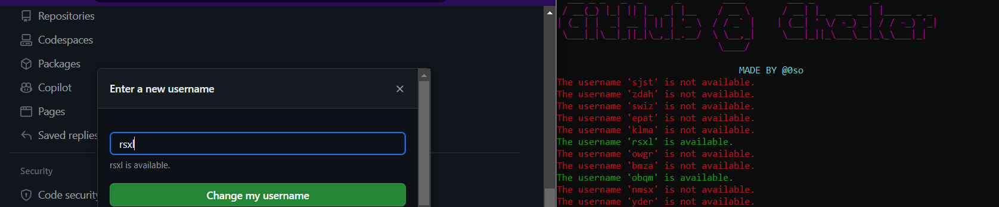

# GitHub Username Checker

Este programa verifica la disponibilidad de nombres de usuario en GitHub. Utiliza una combinación de letras y números para generar todos los posibles nombres de usuario de 4 caracteres y luego verifica si están disponibles en GitHub.



## Cómo funciona

- El programa genera todas las combinaciones posibles de 3 caracteres utilizando letras y números.
- Para cada combinación, envía una solicitud GET a la URL de GitHub correspondiente al nombre de usuario.
- Si la respuesta es un código de estado 404, significa que el nombre de usuario está disponible.
- Si el nombre de usuario está disponible, se escribe en un archivo llamado `available_usernames.log`.

## Cómo ejecutar

1. Clona el repositorio.
2. Instala las dependencias necesarias ejecutando 
```sh 
pip install -r requirements.txt
```
3. Ejecuta el programa con 
```sh 
python main.py
```
4. El programa comenzará a verificar la disponibilidad de nombres de usuario y escribirá los resultados en el archivo `available_usernames.log`